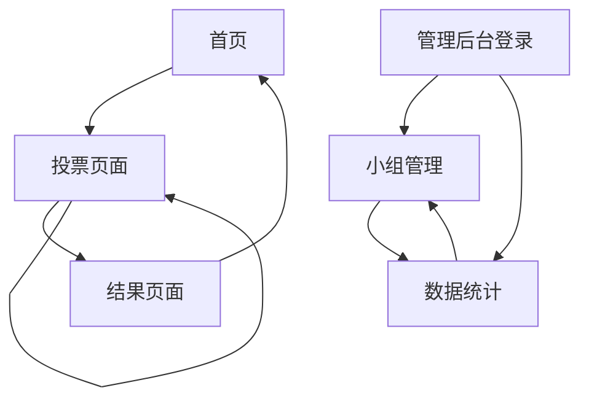

# 编程大赛投票系统 - 产品需求文档

## 1. Product Overview

编程大赛线上投票系统是一个专为编程竞赛设计的移动端投票平台，旨在为参赛小组评选人气奖。
系统通过设备限制机制确保投票公平性，为观众提供便捷的投票体验，同时为主办方提供实时的投票数据统计。

## 2. Core Features

### 2.1 User Roles

| 角色 | 注册方式 | 核心权限 |
|------|----------|----------|
| 普通用户 | 无需注册，直接访问 | 可浏览参赛小组信息，进行投票（每设备限制次数） |
| 管理员 | 后台账号登录 | 可管理参赛小组信息，查看投票统计，导出数据 |

### 2.2 Feature Module

我们的编程大赛投票系统包含以下主要页面：
1. **首页**：大赛介绍、投票规则说明、参赛小组展示
2. **投票页面**：小组详情展示、投票操作、实时票数显示
3. **结果页面**：实时排行榜、投票统计图表
4. **管理后台**：小组管理、投票数据统计、系统设置

### 2.3 Page Details

| Page Name | Module Name | Feature description |
|-----------|-------------|---------------------|
| 首页 | 大赛横幅 | 显示大赛标题、时间、主办方信息，营造活动氛围 |
| 首页 | 投票规则 | 清晰展示投票规则、限制说明、截止时间 |
| 首页 | 小组预览 | 网格布局展示所有参赛小组，包含小组名称、简介、当前票数 |
| 投票页面 | 小组详情 | 展示小组详细信息：项目名称、成员介绍、项目描述、技术栈 |
| 投票页面 | 投票操作 | 大按钮投票设计，显示剩余投票次数，投票后实时反馈 |
| 投票页面 | 实时统计 | 显示当前票数、排名变化、投票进度条 |
| 结果页面 | 排行榜 | 实时更新的小组排名列表，显示票数和排名变化趋势 |
| 结果页面 | 统计图表 | 投票趋势图、时段分析、设备来源统计 |
| 管理后台 | 小组管理 | 添加、编辑、删除参赛小组信息，上传小组图片 |
| 管理后台 | 数据统计 | 投票总览、异常检测、IP分析、导出功能 |

## 3. Core Process

**普通用户投票流程：**
用户访问首页 → 浏览参赛小组 → 点击感兴趣的小组 → 查看小组详情 → 确认投票 → 查看投票结果 → 可继续为其他小组投票（在限制次数内）

**管理员操作流程：**
管理员登录 → 进入管理后台 → 管理参赛小组信息 → 监控投票数据 → 处理异常情况 → 导出最终结果

## 4. User Interface Design

### 4.1 Design Style

- **主色调**：亮绿色 (#32f08c) 和纯黑色 (#000)
- **辅助色**：深灰 (#1f2937)、中灰 (#374151)、浅灰 (#6b7280)
- **按钮样式**：圆角设计，主题绿色背景，点击有动画反馈
- **字体**：中文使用苹方/微软雅黑，英文使用 Inter，主要字号 16px-24px
- **布局风格**：卡片式设计，顶部导航，黑色背景主题
- **图标风格**：线性图标配合填充图标，统一使用 Lucide React 图标库

#### 主题色使用规范
- **#32f08c（亮绿色）**：用于主要按钮、链接、强调元素、队长身份高亮、投票按钮、进度条等
- **#000（纯黑色）**：用于页面背景、主要容器背景
- **队长显示规范**：队长姓名使用主题绿色 (#32f08c) 高亮显示，不显示"(队长)"文字标识，通过颜色区分身份

### 4.2 Page Design Overview

| Page Name | Module Name | UI Elements |
|-----------|-------------|-------------|
| 首页 | 大赛横幅 | 黑色背景，大标题白色字体，副标题灰色，主题绿色强调元素 |
| 首页 | 小组预览 | 网格布局，深灰卡片背景，队长姓名用主题绿色高亮，票数用绿色徽章显示 |
| 投票页面 | 小组详情 | 深灰卡片，白色文字，队长姓名主题绿色高亮（无文字标识），标签用绿色设计 |
| 投票页面 | 投票操作 | 底部固定大按钮，主题绿色背景，投票后变为已投票状态（深灰色） |
| 结果页面 | 排行榜 | 列表布局，前三名用主题绿色特殊标识，进度条使用绿色显示得票比例 |
| 队伍注册页面 | 注册表单 | 黑色背景，深灰表单卡片，主题绿色按钮和强调元素，白色文字 |

### 4.3 Responsiveness

系统采用移动端优先设计，主要针对手机端优化，同时兼容平板和桌面端访问。支持触摸手势操作，按钮尺寸符合移动端点击标准（最小44px），文字大小适合移动端阅读。