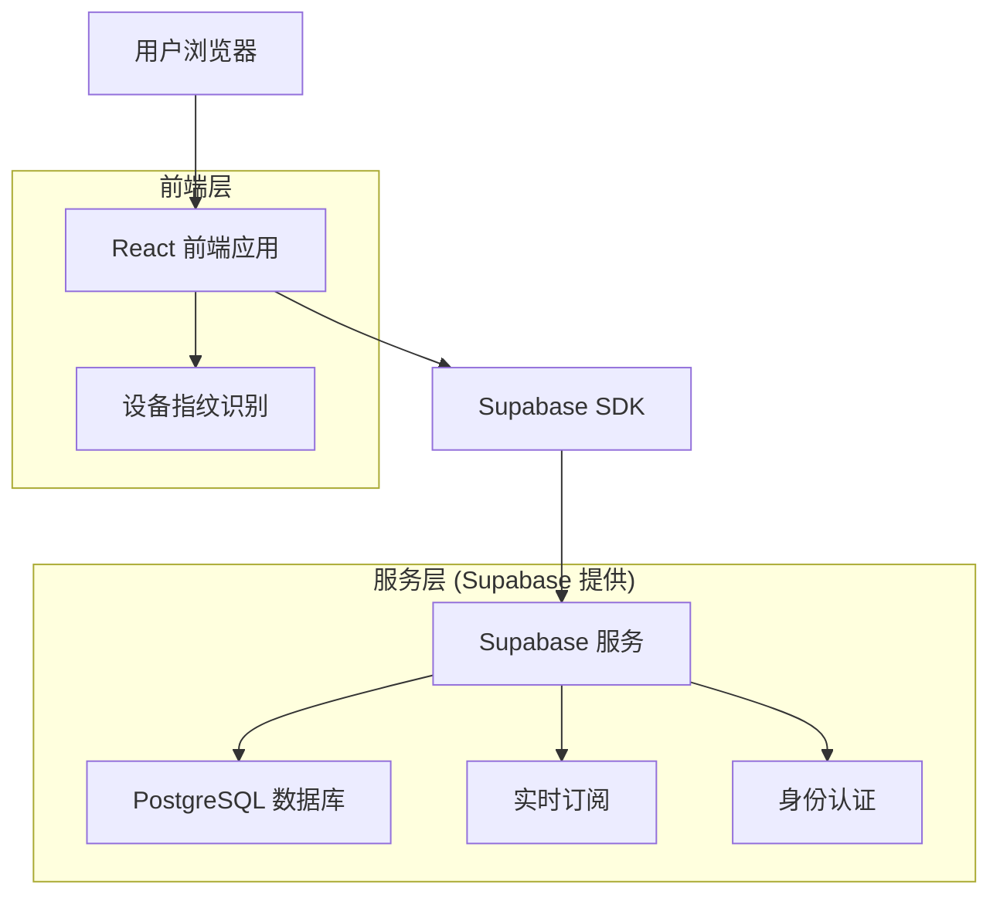
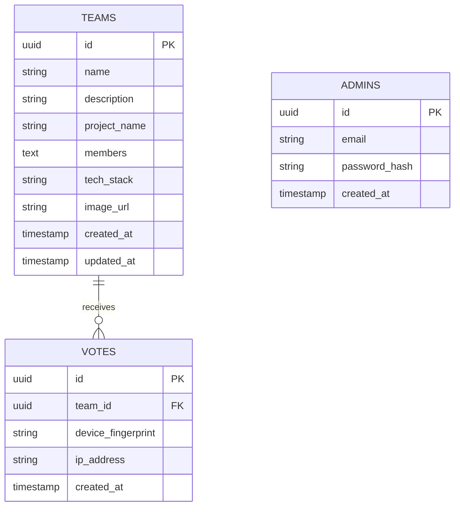

# 编程大赛投票系统 - 技术架构文档

## 1. Architecture design



## 2. Technology Description

* **前端**: React\@18 + TypeScript + Tailwind CSS\@3 + Vite + FingerprintJS

* **后端**: Supabase (PostgreSQL + 实时订阅 + 认证)

* **部署**: Vercel (前端) + Supabase (后端服务)

## 3. Route definitions

| Route            | Purpose            |
| ---------------- | ------------------ |
| /                | 首页，显示大赛信息和参赛小组列表   |
| /vote/:teamId    | 投票页面，显示指定小组详情和投票操作 |
| /results         | 结果页面，显示实时排行榜和统计数据  |
| /admin           | 管理后台登录页面           |
| /admin/dashboard | 管理员仪表盘，数据统计和系统管理   |
| /admin/teams     | 小组管理页面，增删改查参赛小组    |

## 4. API definitions

### 4.1 核心 API (通过 Supabase SDK)

**投票相关**

```typescript
// 提交投票
const submitVote = async (teamId: string, deviceFingerprint: string) => {
  const { data, error } = await supabase
    .from('votes')
    .insert({
      team_id: teamId,
      device_fingerprint: deviceFingerprint,
      ip_address: userIP,
      created_at: new Date().toISOString()
    });
}

// 检查设备投票次数
const checkVoteLimit = async (deviceFingerprint: string) => {
  const { count } = await supabase
    .from('votes')
    .select('*', { count: 'exact' })
    .eq('device_fingerprint', deviceFingerprint);
}
```

**小组数据**

```typescript
// 获取所有小组
const getTeams = async () => {
  const { data } = await supabase
    .from('teams')
    .select(`
      *,
      vote_count:votes(count)
    `)
    .order('created_at');
}

// 实时订阅投票更新
const subscribeToVotes = () => {
  return supabase
    .channel('votes')
    .on('postgres_changes', 
      { event: 'INSERT', schema: 'public', table: 'votes' },
      (payload) => {
        // 更新实时票数
      }
    )
    .subscribe();
}
```

## 5. Data model

### 5.1 Data model definition



### 5.2 Data Definition Language

**参赛小组表 (teams)**

```sql
-- 创建小组表
CREATE TABLE teams (
    id UUID PRIMARY KEY DEFAULT gen_random_uuid(),
    name VARCHAR(100) NOT NULL,
    description TEXT,
    project_name VARCHAR(200) NOT NULL,
    members TEXT NOT NULL,
    tech_stack VARCHAR(500),
    image_url VARCHAR(500),
    created_at TIMESTAMP WITH TIME ZONE DEFAULT NOW(),
    updated_at TIMESTAMP WITH TIME ZONE DEFAULT NOW()
);

-- 创建索引
CREATE INDEX idx_teams_created_at ON teams(created_at);
CREATE INDEX idx_teams_name ON teams(name);

-- 设置权限
GRANT SELECT ON teams TO anon;
GRANT ALL PRIVILEGES ON teams TO authenticated;
```

**投票记录表 (votes)**

```sql
-- 创建投票表
CREATE TABLE votes (
    id UUID PRIMARY KEY DEFAULT gen_random_uuid(),
    team_id UUID NOT NULL REFERENCES teams(id) ON DELETE CASCADE,
    device_fingerprint VARCHAR(200) NOT NULL,
    ip_address INET,
    created_at TIMESTAMP WITH TIME ZONE DEFAULT NOW()
);

-- 创建索引
CREATE INDEX idx_votes_team_id ON votes(team_id);
CREATE INDEX idx_votes_device_fingerprint ON votes(device_fingerprint);
CREATE INDEX idx_votes_created_at ON votes(created_at DESC);
CREATE INDEX idx_votes_ip_address ON votes(ip_address);

-- 创建复合索引用于限制检查
CREATE INDEX idx_votes_device_team ON votes(device_fingerprint, team_id);

-- 设置权限
GRANT SELECT, INSERT ON votes TO anon;
GRANT ALL PRIVILEGES ON votes TO authenticated;
```

**管理员表 (admins)**

```sql
-- 创建管理员表
CREATE TABLE admins (
    id UUID PRIMARY KEY DEFAULT gen_random_uuid(),
    email VARCHAR(255) UNIQUE NOT NULL,
    password_hash VARCHAR(255) NOT NULL,
    created_at TIMESTAMP WITH TIME ZONE DEFAULT NOW()
);

-- 设置权限
GRANT ALL PRIVILEGES ON admins TO authenticated;
```

**创建视图用于统计**

```sql
-- 创建小组投票统计视图
CREATE VIEW team_vote_stats AS
SELECT 
    t.id,
    t.name,
    t.project_name,
    t.description,
    t.members,
    t.tech_stack,
    t.image_url,
    COUNT(v.id) as vote_count,
    t.created_at,
    t.updated_at
FROM teams t
LEFT JOIN votes v ON t.id = v.team_id
GROUP BY t.id, t.name, t.project_name, t.description, t.members, t.tech_stack, t.image_url, t.created_at, t.updated_at;

-- 设置视图权限
GRANT SELECT ON team_vote_stats TO anon;
GRANT ALL PRIVILEGES ON team_vote_stats TO authenticated;
```

**初始化数据**

```sql
-- 插入示例参赛小组
INSERT INTO teams (name, project_name, description, members, tech_stack, image_url) VALUES
('代码忍者', '智能代码审查系统', '基于AI的代码质量检测和优化建议系统', '张三、李四、王五', 'React, Node.js, Python, TensorFlow', '/images/team1.jpg'),
('算法大师', '高效排序可视化工具', '多种排序算法的可视化演示和性能对比平台', '赵六、钱七、孙八', 'Vue.js, D3.js, Java, Spring Boot', '/images/team2.jpg'),
('全栈战士', '在线协作开发平台', '支持多人实时协作的云端开发环境', '周九、吴十、郑十一', 'Angular, TypeScript, Go, Docker', '/images/team3.jpg');

-- 插入管理员账号 (密码需要在应用中加密)
INSERT INTO admins (email, password_hash) VALUES
('admin@hackathon.com', '$2b$10$example_hashed_password');
```

